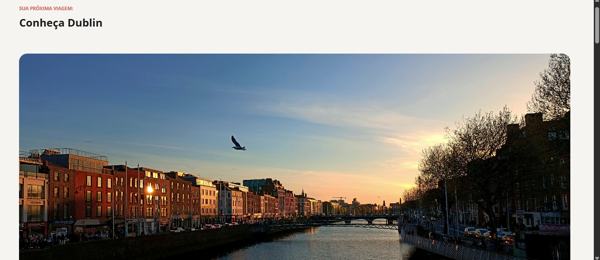
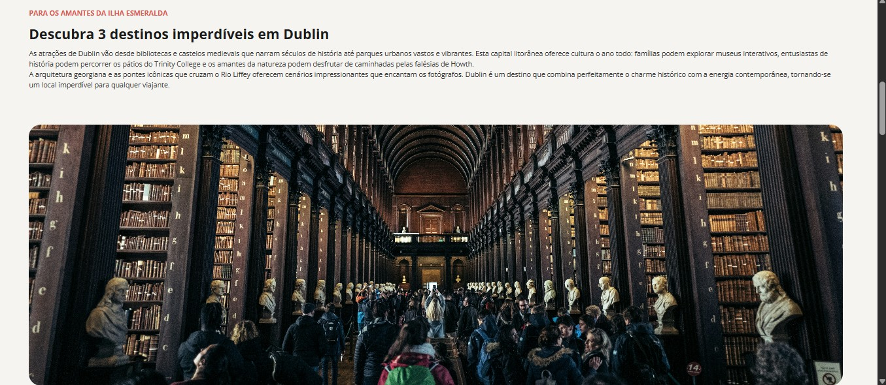
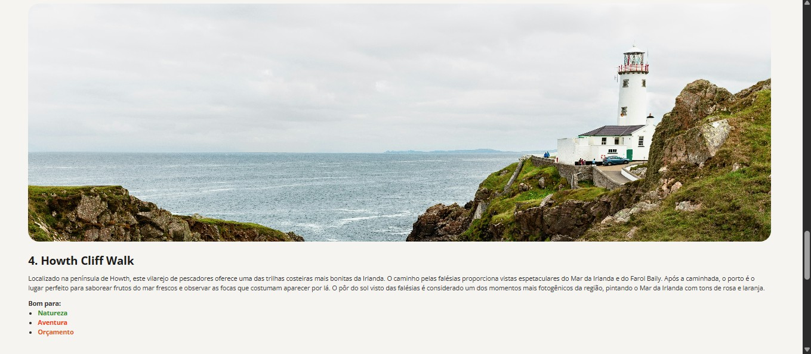
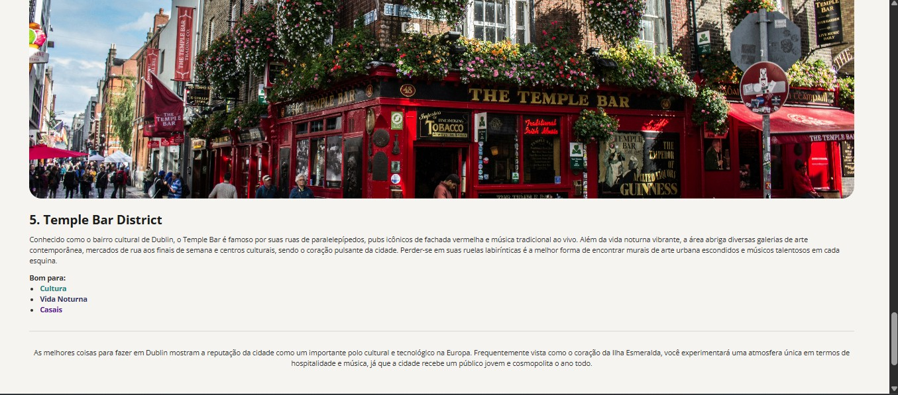

# Dublin Tourism - Landing Page
A tourism landing page about Dublin featuring attractions, images, and descriptive content, built using semantic HTML and CSS.

## 🛠️ Technologies Used
- HTML5
- CSS3

## 👀 How to View
1. Clone or download the repository.
2. Open `index.html` in your web browser.

## 🖼️ Assets
Images and icons are stored in the `assets/` folder.

## 🙌 Credits
- Original project by Rocketseat (Full-Stack Formation – "Local Turístico")
- Modified by Gabriela Spanemberg Bado
- Images: Unsplash (Nistala Maneesh, Alexandra Mitache, Help Stay, Loris Boulinguez, Elliot Voilmy, Brian Kelly, Matheus Câmara da Silva)

## 📄 License
This project is for educational purposes.

## 🖥️ Preview

> Examples of the project interface.